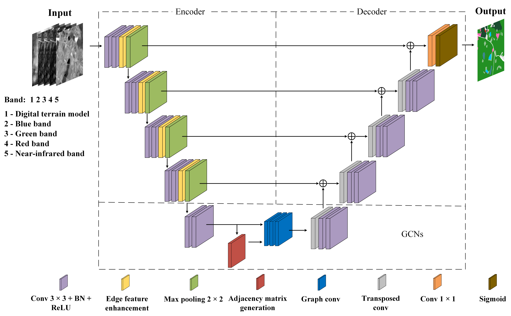
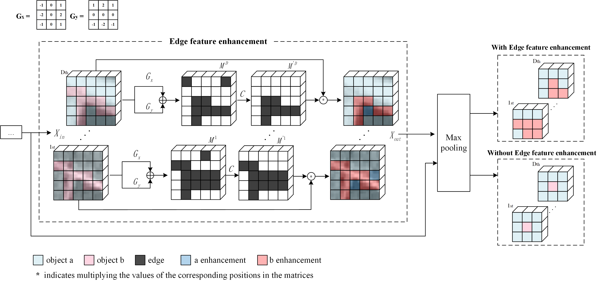
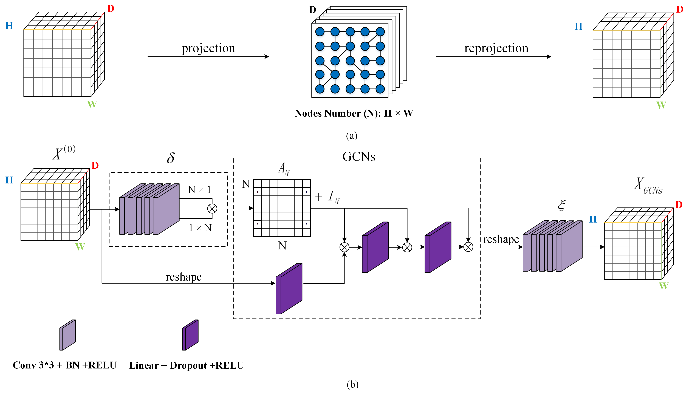

# EG-UNet
Deep feature enhancement method for land cover with irregular and sparse spatial distribution features: a case study on open-pit mining

Gaodian Zhou, Jiahui Xu, Weitao Chen, Xianju Li, Jun Li and Lizhe Wang,[Deep feature enhancement method for land cover with irregular and sparse spatial distribution features: a case study on open-pit mining](https://ieeexplore.ieee.org/abstract/document/10034775)(IEEE TGRS, 2023)

Framework-EG-UNet

Edge Enhancement Moudle

GCN

## quick start
### requirements
python 3.6 CUDA10.1 GPU:2080Ti*1

pytorch==1.1.0
tqdm==4.49.0
Pillow==6.1.0
opencv-python==4.1.0.25
GDAL==3.0.4
### parameters
You can change epoch，batch_size，lr and decay in train_config.json
### train
1.Download the files mentioned in "newdata/readme"  
2.python3 main.py  

It will create a folder, named 'logs', and a log file. This log file will record the training process. 

And the trained model, with maximum OA in validation set, will be saved in a folder, named 'saved', and record the epoch num in 'best_epoch.txt' when saving the model. 
### eval
1.python3 eval.py  

It will evalute this model in test dataset, and print the metrics, including OA, IOU, precision, recall, F1, then save the confusion matrix in 'saved' folder.
### perdict
1.python3 predict.py  

You can find the visual results in 'predict/'.

## cite
    @ARTICLE{10034775,
    author={Zhou, Gaodian and Xu, Jiahui and Chen, Weitao and Li, Xianju and Li, Jun and Wang, Lizhe},
    journal={IEEE Transactions on Geoscience and Remote Sensing}, 
    title={Deep Feature Enhancement Method for Land Cover With Irregular and Sparse Spatial Distribution Features: A Case Study on Open-Pit Mining}, 
    year={2023},
    volume={61},
    number={},
    pages={1-20},
    doi={10.1109/TGRS.2023.3241331}}
